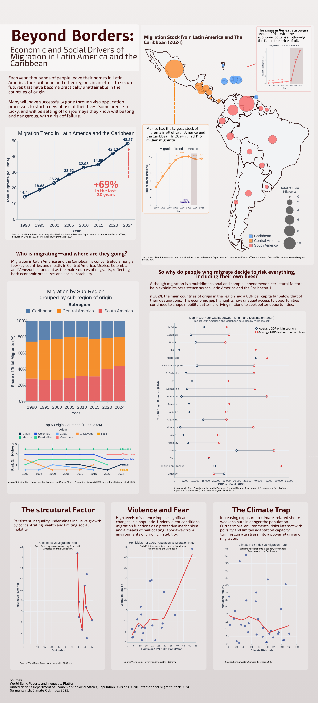

# Daniela Ayala Chavez 

# Beyond Borders: Economic and Social Drivers of Migration in Latin America and the Caribbean

## Overview
Migration in Latin America and the Caribbean (LAC) has evolved significantly over the last three decades.  
The visualization intends to explore the more than migration stock and go deeper into structural drivers and patterns of migration in Latin America and the Caribbean.

The visual narrative includes:

- A bubbles map of migration stock across the region.
- Comparative graphs illustrating the GDP per capita gap between origin and destination countries.
- Rank line charts showing the top migration origins and destinations over time.
- Scatter plots relating migration rates to key structural variables such as the Gini Index, Climate Risk Index, and Homicide Rate of countries in LAC.

## Data Sources

- World Bank Open Data (2024) — Indicators: GDP per capita, Gini Index, Total Population, and Homicide rates per 100,000 inhabitants https://data.worldbank.org/indicator/NY.GDP.PCAP.CD

- UN DESA International Migrant Stock Database (2024 Revision) — Migration stocks by origin and destination. https://www.un.org/development/desa/pd/content/international-migrant-stock

- Germanwatch - Climate Risk index 2025 https://www.germanwatch.org/en/cri

## Charts Code

You can find all the code in the src/charts_creation.ipynb file
