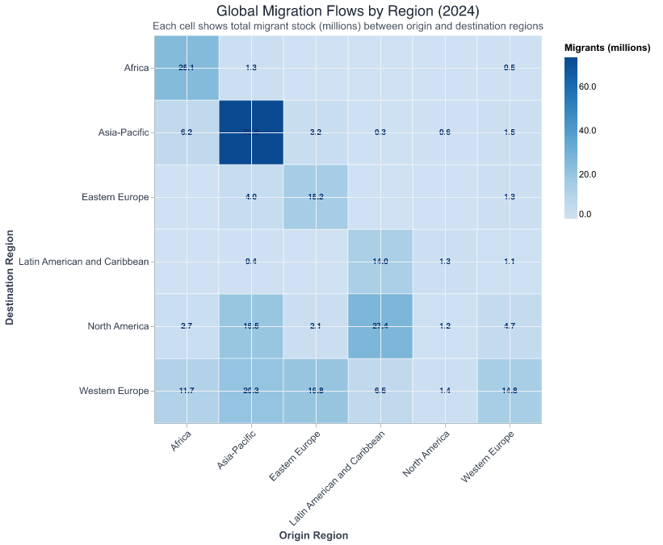
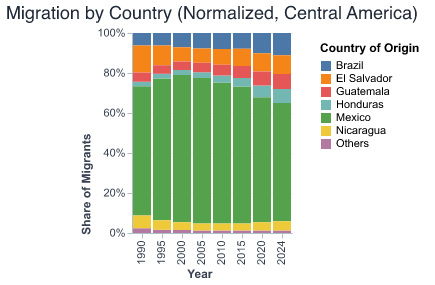
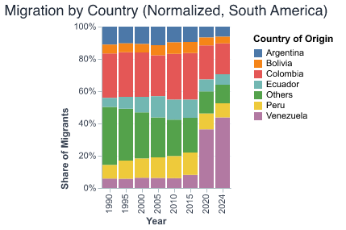
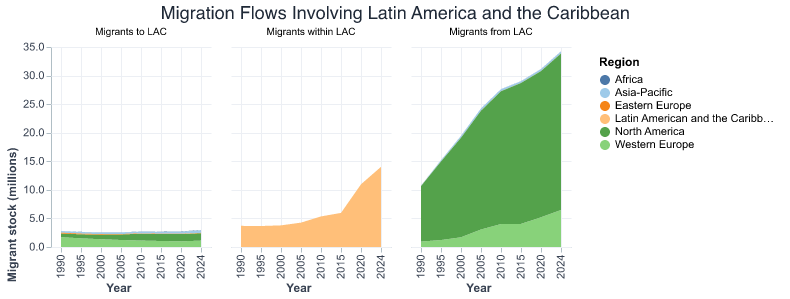
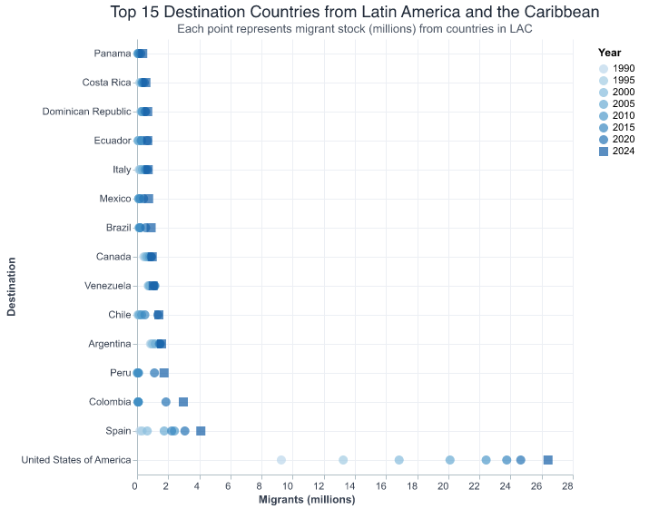
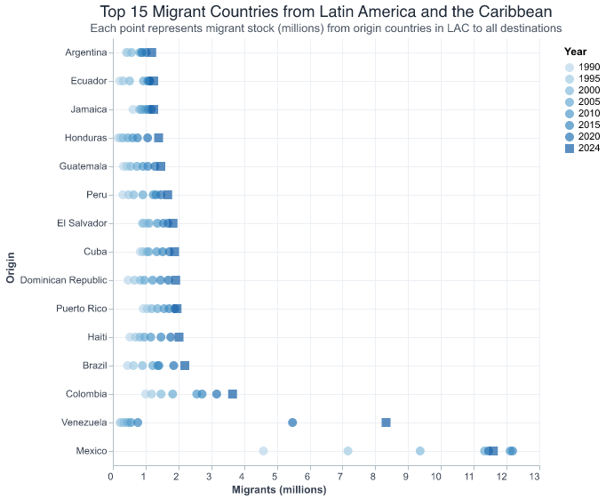

# Daniela Ayala Chavez 

# Migration Dynamics in Latin America and the Caribbean (LAC)

## Overview
Migration in Latin America and the Caribbean (LAC) has evolved significantly over the last three decades.  
The following visualizations illustrate how both the **origins** and **destinations** of migrants have shifted globally, and how demographic and regional factors continue shaping the movement of people.

---
## Visualizations

**Figure 1.** *Migration by Destination and Origin Regions, 1990–2024.*

These charts reveal how international migration has grown across all regions.  
While North America and Western Europe remain the largest destinations, migration originating from **Latin America and the Caribbean** has also expanded steadily.  
This reflects economic integration, demographic change, and climate-related pressures influencing both emigration and return flows.

  

---
**Figure 2.** *Global migration flows by origin and destination regions, 2024.*

This heatmap provides a global snapshot of migration flows in 2024, where each cell represents the total **migrant stock (in millions)** moving from an origin region (columns) to a destination region (rows).  
The darkest cells correspond to the largest migration corridors — notably the strong connections between **Asia-Pacific** countries and within **North America** and **Western Europe**.

Although the Latin America and Caribbean (LAC) region accounts for a smaller share of total global migration, it displays a distinctive pattern:  
- Moderate **outflows to North America and Western Europe**,  
- Growing **intraregional mobility within LAC**, and  
- Limited **inflows from other regions**.

  

---

**Figure 3.** *Migration from Latin America and the Caribbean by gender and by subregion, 1990–2024.*

Migration from LAC has not only grown in volume but also diversified in its demographic and spatial characteristics.  
The left panel shows the **gender composition** of migrants over time — the share of **female migrants** has increased steadily since the 1990s, reflecting broader social and economic participation of women in mobility networks.  

On the right, migration is broken down by **subregion** (Caribbean, Central America, South America).  
While **South America** dominates in absolute numbers, **Central America** shows the steepest growth rate, largely driven by northward flows linked to economic opportunity and instability.  
The **Caribbean** maintains high levels of outward migration relative to its population, shaped by historical ties and remittance-based economies.

  
  

---

**Figure 4.** *Migration by country of origin within LAC subregions (normalized by share of migrants, 1990–2024).*

At the country level, migration patterns show both continuity and transformation.  
In **Central America**, emigration remains heavily concentrated in **Mexico**, **El Salvador**, and **Guatemala**, with growing contributions from **Honduras** and **Nicaragua** over time.  
The **Caribbean** displays a more diversified pattern, with sustained flows from **Cuba**, **Haiti**, and the **Dominican Republic**, reflecting both economic and environmental vulnerabilities.  
Meanwhile, **South America** exhibits a major shift in recent years: **Venezuela** and **Colombia** have become dominant sources of migrants, while traditional corridors from **Argentina**, **Peru**, and **Brazil** remain relevant but proportionally smaller.

These patterns underscore the **regional asymmetries** of migration in LAC — from persistent Central American northward routes to the Caribbean’s circular and transnational mobility, and the newer displacement dynamics emerging in South America.

  
  
  

---
**Figure 5.** *Migration flows involving Latin America and the Caribbean (1990–2024).*

This visualization provides a global overview of migration connected to **Latin America and the Caribbean (LAC)** — distinguishing between:
- **Migrants to LAC**, representing inflows from other world regions,
- **Migrants within LAC**, showing intraregional mobility, and
- **Migrants from LAC**, reflecting outward migration to destinations such as North America and Western Europe.

  

---

**Figure 6.** *Top 15 migration origin and destination countries from Latin America and the Caribbean, 1990–2024.*

These charts present the main **destination** and **origin** countries associated with migration flows in Latin America and the Caribbean (LAC).  
Each point represents the total **migrant stock (in millions)** at a given year, revealing how the scale and direction of migration have evolved over time.

On the left, **destination countries** show that the **United States**, **Spain**, and **Canada** remain the primary destinations for migrants from LAC, followed by emerging hubs such as **Chile**, **Brazil**, and **Mexico**, which increasingly host regional migrants.  
On the right, **origin countries** highlight the persistent role of **Mexico**, **Venezuela**, and **Colombia** as major sources of migration, alongside smaller but consistent flows from **Caribbean** nations like **Cuba**, **Haiti**, and the **Dominican Republic**.

  
  

---
**Figure 6.** *Migration flows from Latin America and the Caribbean (2024).  
Bubble size = total migrants • Color = origin subregion.*

This map visualizes the **geographic distribution** of migration from Latin America and the Caribbean in 2024.  
Each bubble represents a country of origin, with its size proportional to the total number of migrants and its color indicating the subregion (Caribbean, Central America, South America).

The spatial pattern reveals three major clusters:
- **Caribbean countries**, such as the Dominican Republic, Haiti, and Cuba, continue to exhibit high emigration relative to their population size.  
- **Central America**, led by Guatemala, El Salvador, and Honduras, forms a dense migration corridor directed primarily toward North America.  
- **South America** shows a more dispersed pattern, with Venezuela, Colombia, and Argentina as key sources of regional and extra-regional migration.

  

---
 
You can find the complete code and data workflow in [`../scratch/exploration.ipynb`](../scratch/exploration.ipynb).

